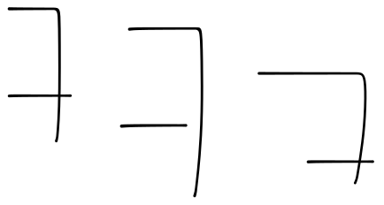

# 연습

<table data-view="cards"><thead><tr><th></th><th></th><th></th></tr></thead><tbody><tr><td></td><td></td><td></td></tr><tr><td></td><td></td><td></td></tr><tr><td></td><td></td><td></td></tr><tr><td></td><td></td><td></td></tr><tr><td></td><td></td><td></td></tr><tr><td></td><td></td><td></td></tr></tbody></table>

```
// Some code
```



```javascript
// Some code
const a = 1;
const b = 2;

function add(a, b) {
    return a + b;
}
```



```typescript
// Some code
const a = 1;
const b = 2;
function add(a: number, b: number) {
    return a + b;
}
```




구글



todolist 예시 codepen


<details>

<summary>더보기</summary>


</details>




[Broken link](broken-reference)


